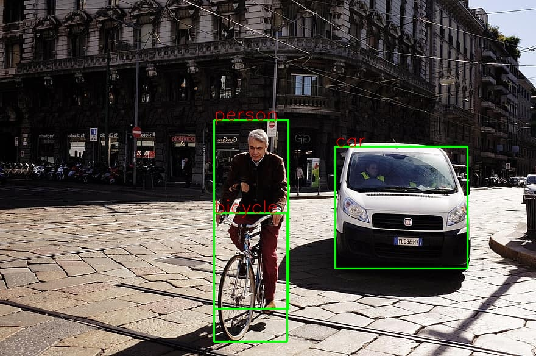

# Object Detection with YOLOv3

## Objective

YOLOv3 is an improved version of YOLOv2 that has greater accuracy ans mAP score.
In this project I'd like to build an object detection network with a YOLOv3 pre-trained model and see 
how it works. This YOLOv3 model is trained on MS-COCO dataset that can detect 90 different classes of objects 
like cars, trucks, bikes, people and many more!

## Dependencies & Environment
* Ubuntu 16.04
* Python 3.6
* OpenCV 4.4.0
* Tensorflow-gpu 2.0.0
* Tensornets 0.4.6

Please see [environment.yml](./environment.yml) for more requirements. 

## Prepare

Install **tensorflow-gpu** to use gpu for calculation.
```sh
pip install tensorflow-gpu
```

Install **tensornets**, a PyPi library which converts various popular networks' weights into 
tensorflow's format.
```sh
pip install tensornets
```

## Quick start

Run [main.py](./main.py) to start using pre-trained YOLOv3 weights in [detection.py](./detection.py)
to detect person, bicycle, car, bike, bus and truck.
```sh
python main.py
```



## Conclusion

* The accuracy of YOLOv3 for object detection is sooooo good!
* The speed of YOLOv3 depends on gpu performance, with Nvidia Titan it can go up to 30 fps.
